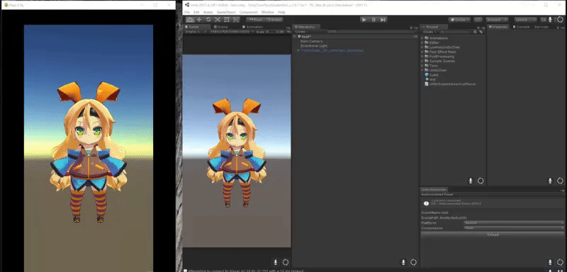
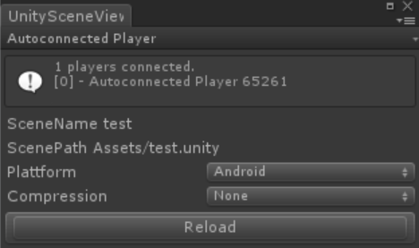

# UnitySceneViewKun
## 概要
UnityEditorで編集中のSceneを実機上で表示するプロジェクトです。 
UnityEditorの左側のWindowが実機だと思って下さい。

## 動作確認環境
### 動作確認済みUnity
- Unity2017.4.24f1
- Unity2018.3.12f1
### 動作確認済みプラットフォーム
- Android
- iOS

## 使い方
Build Settings よりDevelopmentとAutoconnect ProfilerをONにした状態でビルドを行い、対象となるプラットフォーム上で事前に実行して下さい。
下記の手順でUnityEditor上で編集している任意のシーンを実機上に表示することが出来ます。

1. Window->UnitySceneViewerKunを選択する下記のWindowを開きます。 

2. Window左上のプルダウンメニューから対象となるPlayerを選択します。
3. Window中央のプルダウンメニューからPlattoformを選択します。
4. Reloadボタンを押します。
