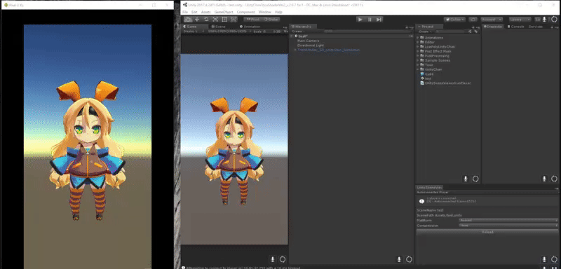

# UnitySceneViewerKun
## Summary
This project allows you to display the scene being edited inside Unity editor on actual device. It's also capable of hot reloading, which comes in handy for a quick check of the result you edited in the scene to the actual device. 

The left side of the image is the screen displayed on Adroid device.
## Operating Environment 
### Unity Version
- Unity2017.4.24f1
- Unity2018.4.31f1
- Unity2019.4.19f1
### Platform
- Android
- iOS

## How to use
### Things to prepare in advance (Player Build)
Execute Build & Run `Scenes/UnitySceneViewKun.unity` with Development and Autoconnect Profiler turned ON on the device.

### How to reload scene
Follow the procedure below to transfer the Scene edited on Unity Editor to the actual machine:
1. Open the Scene you want to check on the actual machine in Unity Editor. 
2. Select Window->UnitySceneViewerKun、Then open UnitySceneViewerKun Window. 
  
3. Select Player which was executed earlier from the pull-down menu on the upper left window.(It's equivalent to selecting where to connect in Profiler or Frame Debugger)
4. Select Player's Platform in the center of Window pull-down menu.
5. Press Reload button.
6. The Scene opened in Unity Editor will be displayed on the actual device. (It'll take sometime to update depending on the number of Assets the scene holds)

That'll be all
## Other
If you have any problems, please report them from the Issue Tracker.
Comments and feedback are welcome! 
__Katsumasa Kimura：katsumasa@unity3d.com__

